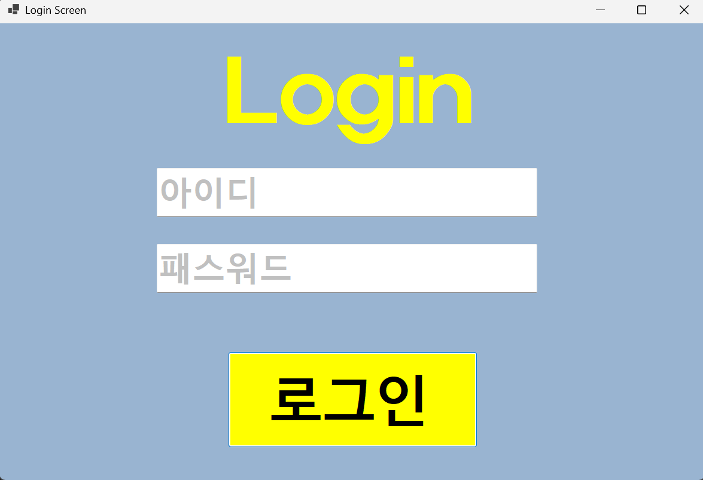
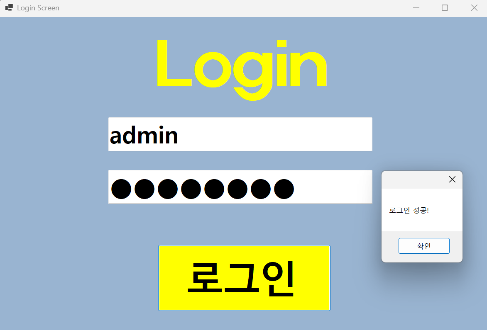
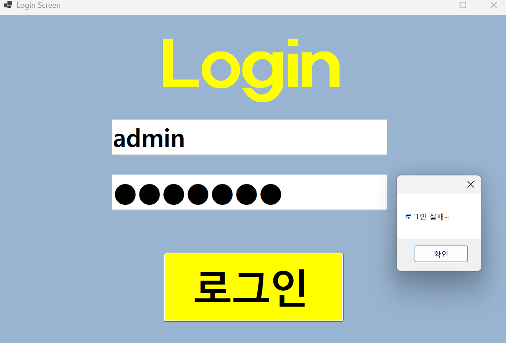
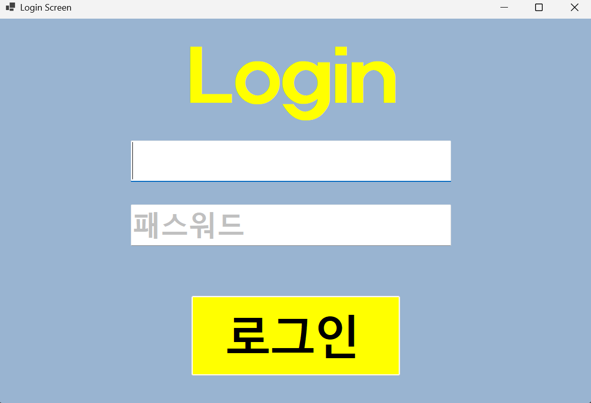
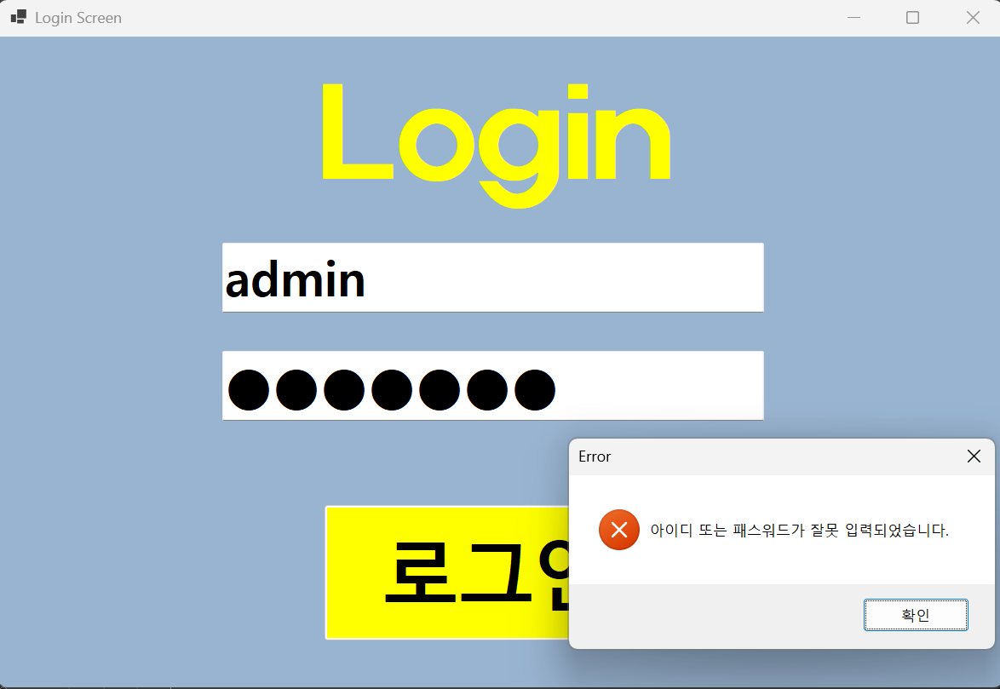
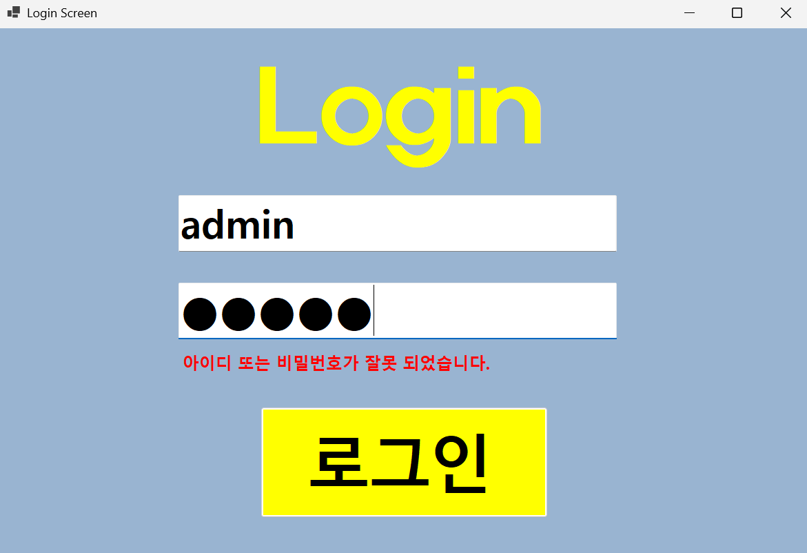

# (C# 코딩) 로그인 스크린

## 개요
- C# 프로그래밍 학습
- 1줄 소개: 사용자의 아이디와 패스워드를 입력받는 로그인 화면 만들기
- 사용한 플랫폼:
	- C#, .NET Windows Forms, Visual Studio, GitHub
- 사용한 컨트롤:
	- Label, TextBox, Button
- 사용한 기술과 구현한 기능:
	- Visual Studio를 이용하여 기본 UI 배치 및 기능 구현
	- 패스워드 입력 내용을 숨기는 기능 구현
	- Placeholder 기능 구현
	- 탭을 이용한 입력 포커스 제어 구현
	- 로그인 성공/실패 메시지 박스 보여주기
- 수업 중에 배우고 사용했던 클래스들 관련된 설명
	- placeholder 기능을 구현하기 위해 TextBox 컨트롤의 Focus관련 이벤트를 활용합니다.
	- visible 속성을 이용해서 메시지 보이기와 숨기기 기능 구현합니다.
	- MessageBoxButtons을 통해 로그인 실패 시 "아이디 또는 패스워드가 잘못 입력되었습니다." 라는 문구가 적힌 오류 메시지 박스 보여주기 기능 구현합니다.
	- lblErrorMsg.Visible을 이용해서 굳이 에러메세지 박스를 띄우지 않아도 빨간색 문구로 아이디 또는 비밀번호가 잘못 입력되었다는 것을 알려주는 기능 구현합니다.
	
- 실습 중에 구현한 기능들 설명
	- placeholder 기능을 이용해 아이디와 패스워드 입력 힌트를 회색으로 표시합니다.
	- Visible 속성을 이용해서 메시지 보이기와 숨기기 기능 구현합니다.
	- MessageBosButtons 클래스를 이용해 로그인 성공/실패 메시지 박스 보여주기 기능 구현합니다.
	- lblErrorMsg.Visible을 이용해 로그인 실패 시 에러 메시지 표시 기능 구현합니다.

## 실행 화면 (과제1)

- 과제1 코드의 실행 스크린샷

- 과제 내용
	- Label(표시), TextBox(입력), Button(전송)를 적절히 배치합니다.
	- Placeholder 기능을 구현합니다
	- 로그인 가능 여부 체크 기능을 구현합니다.
	- 로그인 성공/실패 메시지 박스 보여줍니다.
- 구현 내용과 기능 설명
	- placeholder 기능을 이용해 아이디와 패스워드 입력 힌트를 회색으로 표시합니다.
	- 아이디와 패스워드가 모두 맞아야 로그인 허용하는 로그인 가능 여부 체크 기능입니다.
	- 적절한 메세지 박스를 사용해 로그인에 성공하면 성공 메세지 박스를 띄우고 , 실패하면 실패 메세지 박스를 띄웁니다.

## 실행 화면 (과제2)

- 과제2 코드의 실행 스크린샷

- 과제 내용
	- Enter키 입력을 받기 위한 이벤트 핸들러 추가 
	- Label 컨트롤 추가
	- 로그인 실패 때의 메시지 박스 보여주기 기능 구현
	- Visible 속성을 이용해서 메시지 보이기와 숨기기 기능 구현
	- 에러 메세지 표시 기능 구현
- 구현 내용과 기능 설명
	- 로그인 버튼 클릭 뿐만 아니라 Enter키 입력으로도 로그인 시도할 수 있도록 이벤트 핸들러 추가합니다.
	- MessageBoxButtons을 이용해 로그인 실패 시 메시지 박스 보여주기 기능 구현
	- Label 컨트롤을 사용해서 에러 메시지를 표시합니다. (기본 : Invisible, 오류 발생시 : Visible)